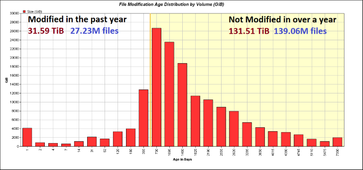

# Pwalk Reporter



## What is Pwalk Reporter

The pwalk_reporter utility takes the output from the [pwalk](https://github.com/fizwit/filesystem-reporting-tools) utility and provides summary statistics about the filesystem.

It provides the following summary statistics:

- Total file count and total file size of the filesystem
- A histogram of file ages broken down by file count and size in a fixed set of bins. The histogram can use either 'mtime' (default) or 'atime'. I plan to make the histogram bins either automatic or provide the ability to specify them in a future release.
- The top 100 file types by total size
- The top 100 largest directories by size

## Usage

After you have the output from [pwalk](https://github.com/fizwit/filesystem-reporting-tools) that you want to summarize (named "filesystem.csv in example below) you simply provide the input file as the parameter and direct the output to a file (named "outputfile.csv in the example).  Basic usage of the utility is shown below:

```bash
pwalk_reporter inputfile.csv > outputfile.csv
```
There are to optional parameters:

- **atime** - switch from using 'mtime' (default) to 'atime' for the file age histogram.
- **offsetdays** \<int\> - if the pwalk output you are working with is not fresh, you can provide a number of days of offset so the histogram fits the dataset

In the example below we want to report on 'atime' and provide summary stats for a 14 day old pwalk dataset:

```bash
pwalk_reporter --atime --offsetdays 14 inputfile.csv > outputfile.csv
```

The output of pwalk reporter looks like the following:

```
Total files, Total size (GiB)
166427070, 163141.20


# NOTE: figures below are for modification time (mtime) ages (default); use '--atime' flag for access time stats
Age Days, Size (GiB), File Count
1, 3783.58, 218244
2, 1117.71, 106586
4, 861.52, 95851
7, 601.89, 125307
14, 869.98, 481482
31, 2398.77, 1661222
62, 1738.10, 1862003
120, 3353.27, 4592033
180, 4050.06, 3782518
365, 12799.27, 14295936
730, 26652.18, 25020297
1095, 23532.28, 22335629
1460, 18738.69, 17382518
1825, 11407.94, 11178298
2190, 10495.11, 8956905
2555, 8843.48, 9569450
2920, 7939.11, 6458341
3285, 5405.02, 5515233
3650, 4299.55, 4588842
4015, 3412.32, 5166867
4380, 3231.63, 4488695
4745, 2642.20, 3360507
5110, 1662.01, 2791978
5475, 1133.19, 3993805
7300, 2031.34, 6956363
10950, 104.69, 1302695


# Top 100 file types
File Extension, Size (GiB)
fcs, 18480.68
tif, 15466.64
pst, 10182.17
mov, 7989.17
jpg, 6817.71
pdf, 6085.92
noext, 5206.34
zip, 4509.11
gz, 4174.82
rdata, 3313.29
txt, 3250.63
cr2, 3194.25
...omitted for brevity 
all-other-types, 14682.08


# Top 100 largest directories
Directory, Size (GiB)
"/mounts/gold/home/bigdir1", 459.24
"/mounts/gold/home/bigdir2", 454.08
"/mounts/gold/home/bigdir3", 389.65
"/mounts/gold/home/bigdir4", 346.61
"/mounts/gold/home/bigdir5", 223.34
"/mounts/gold/home/bigdir6", 220.90
...omitted for brevity 
```

## Installing pwalk reporter

Precompiled binaries of pwalk reporter are available for Linux and Windows at the following links:

- [Windows x86_64](https://gitlab.fhcrc.org/rmcdermo/pwalk_reporter/raw/master/bin/pwalk_reporter.exe)
- [Linux x86_64](https://gitlab.fhcrc.org/rmcdermo/pwalk_reporter/raw/master/bin/pwalk_reporter)


## performance

The pwalk_reporter runs fairly quickly, the output above was from a 181 million row dataset (files and directories) and was processed in about 18 minutes; a rate of around 170K rows per second.